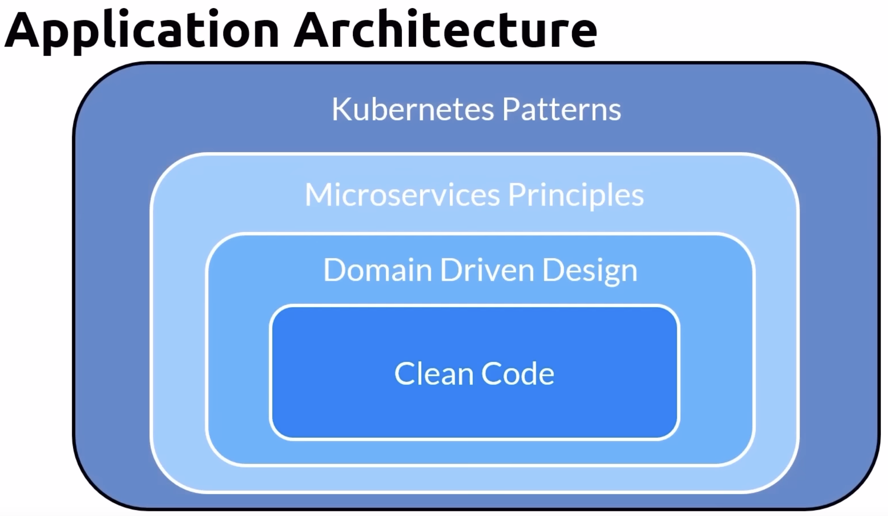

# CLOUD NATIVE

App dev paradigm using containers, service meshes, microservices, immutable infrastructure, and declarative APIs. Allows building and running scalable apps in dynamic envs such as public, private, and hybrid clouds.

These techniques enable loosely coupled systems that are resilient, manageable, and observable. Combined with robust automation, allows frequent, high-impact changes. Speed and agility are important characteristics.

Open-source focused, more vendor-neutral.

## Architecture

## Mindset: More "Cattle" than "Pets"

Infrastructure is immutable and disposable, provisioned in minutes and destroyed on demand, never updated or repaired (but re-provisioned).

## Trail Map and Landscape

<https://github.com/cncf/trailmap>
<https://landscape.cncf.io/guide>
