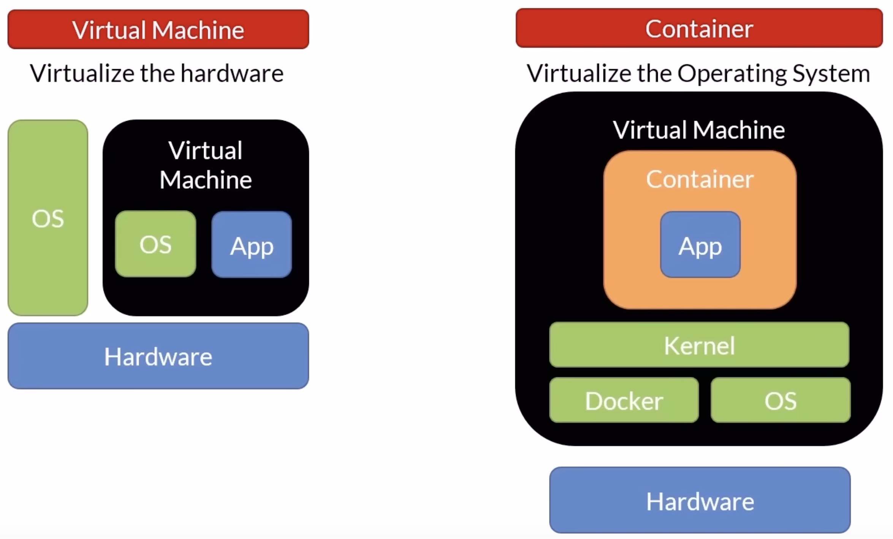
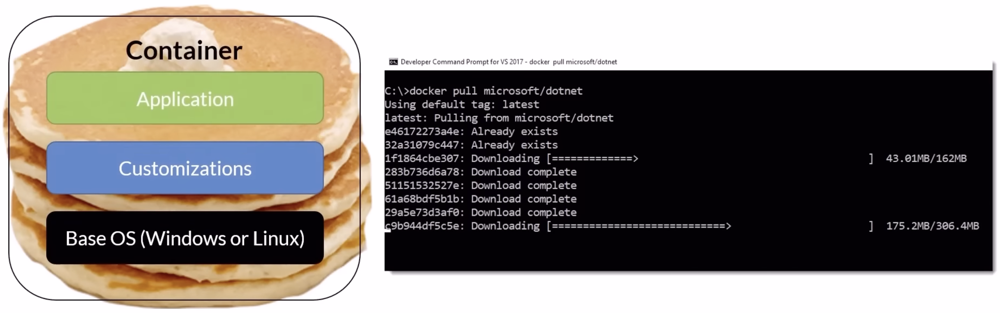

# CONTAINER

Unit of software/deployment, includes everything needed for code to run: code, runtime, system libs, and system tools.

## Why

* Faster by deploying small units.
* Uses fewer resources.
* Can fit more on same host.
* Faster automation.
* Portability.
* Isolation.

## Vs Virtual Machine

VM contains OS, virtualizing hardware. Can be large and slow to boot. Large footprint, ideal for long-running tasks.

Container doesn't need to boot, starts up fast. Uses less resources. Ideal for short-lived tasks.

## Layers

Consists of layers.

When downloading container image, each layer -- with unique id -- is downloaded separately, but Docker caches locally, so only new layers downloaded. Aim to minimize number of layers. Can only write to top layer, everything below is read-only.

## Registry

Centralized container repo, think GitHub. Docker Hub: <https://hub.docker.com/>. All major cloud providers have registry services.

## Orchestrator

Manages infrastructure, containers, deployment (zero-downtime), scaling, failover, monitoring, etc. Can install own or use provider orchestrator services.
